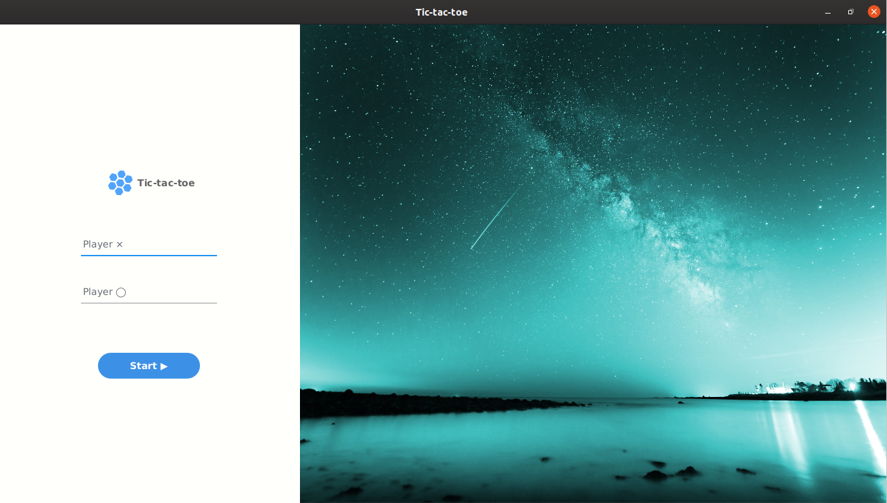
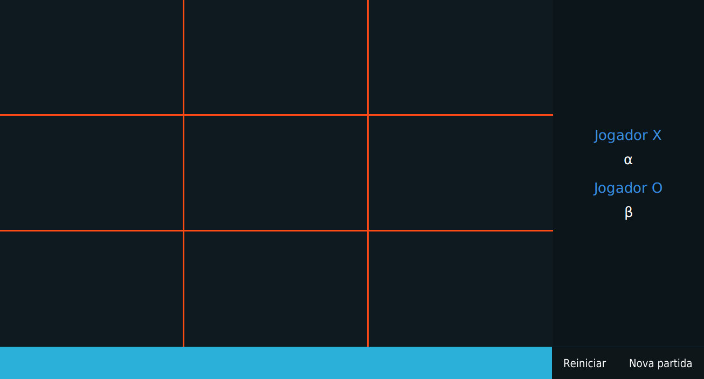

# Tic-tac-toe

Tic-tac-toe game, also know as **noughts and crosses** (british english), for Linux systems.

The project is build with [Spring Boot](https://spring.io/projects/spring-boot) and [JavaFX](https://openjfx.io/) to the graphic interface.
The key idea is to construct a simple and understandable application to learn TDD and desktop development.

## Screenshots

> Initial screen.

> Game board.
